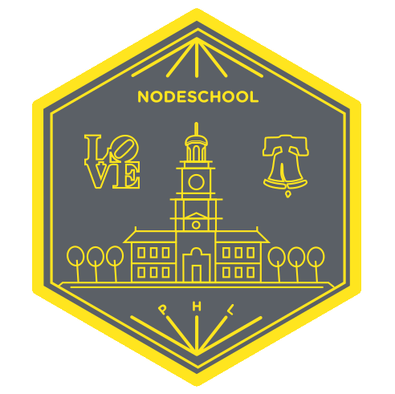

# NodeSchool Philadelphia

Have a question? [Open an issue](https://github.com/nodeschool/philadelphia/issues). We use the GitHub Issues like a message board so all of our communication can be public.

## What is NodeSchool?
NodeSchools are in-person hosted events in which open source workshops are used as curriculum and mentors are available in case you need help.

Please take a moment and look at our [Code of Conduct](https://github.com/nodeschool/philadelphia/blob/master/code-of-conduct.md).

## How can I help?
We are currently looking for:
* [A Venue](https://github.com/nodeschool/philadelphia/issues/4),
* [Organizers](https://github.com/nodeschool/philadelphia/issues/1),
* [Mentors](https://github.com/nodeschool/philadelphia/issues/2),
* [Sponsors](https://github.com/nodeschool/philadelphia/issues/5)

## When is the next NodeSchool Philadelphia event?
We are working on a location, date, and finding mentors right now. As soon as we have a date we will announce it.
